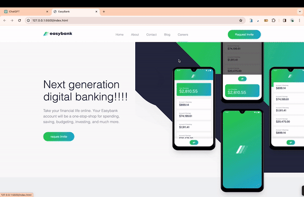

<h1> Easy Bank </h1>

This project is designed to represent a website using HTML and SASS technologies. The use of SCSS has made the CSS code more organized, readable, and manageable, enhancing the overall structure of the website. With responsive design, the interface provides easy and aesthetic use, adapting to every screen size.

<h2> The technologies used in the project </h2>

It was coded using HTML and SCSS technologies.

<h2> Demo </h2>

You can view a live demo of this project [here](https://seliinatmaca.github.io/Easy-Bank).

<h2> Screenshot </h2>

